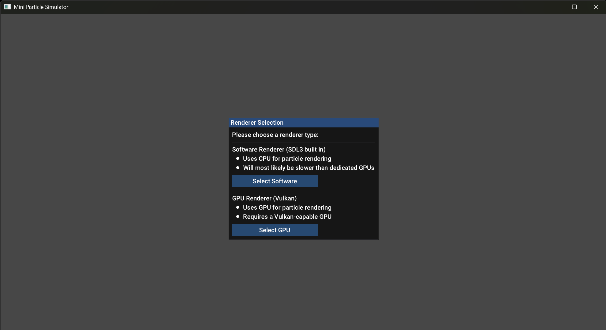
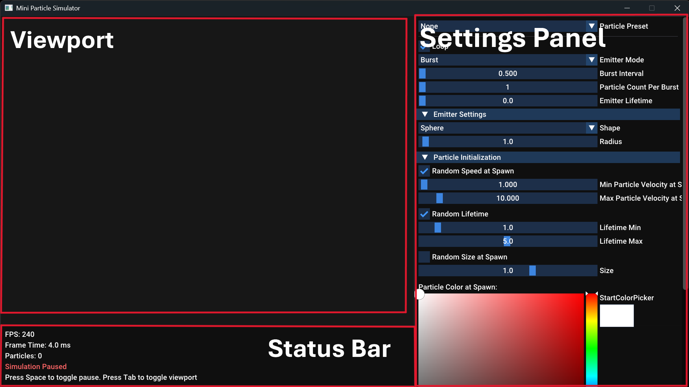
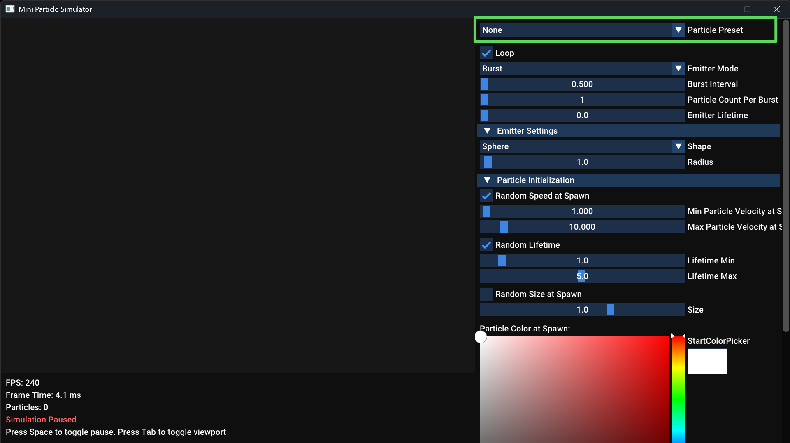
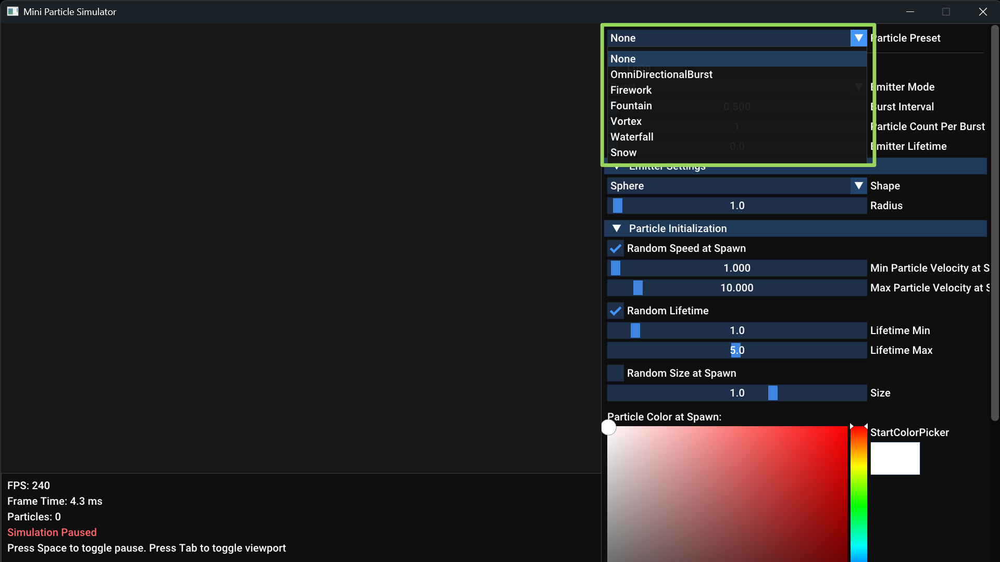
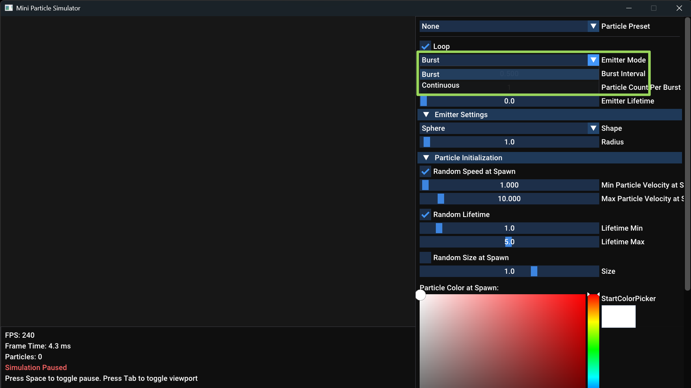
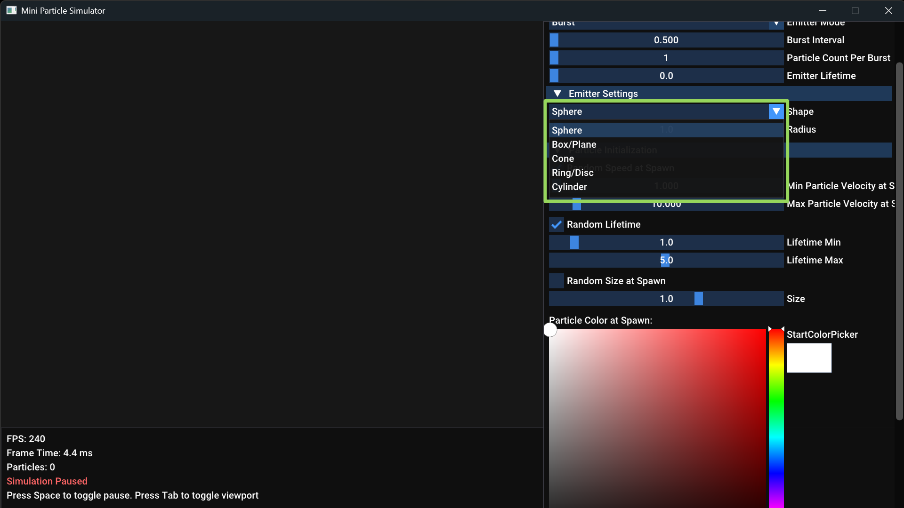
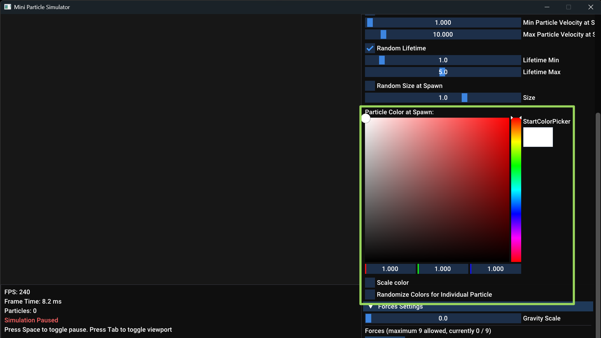
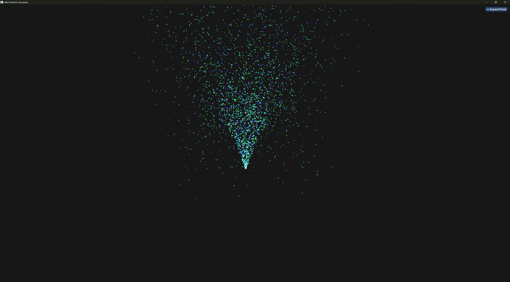
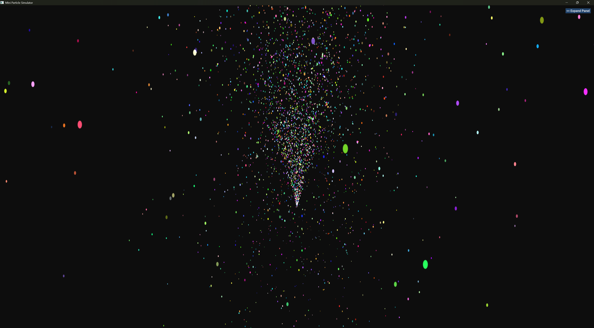
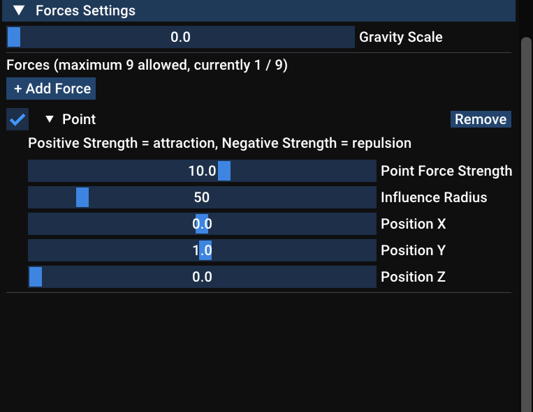

# Mini Particle Simulator (C++, Vulkan, ImGui, and SDL3)

Hello to whoever stumbles upon this little project of ours! This is our attempt to create a miniature particle simulator (it's really tiny, and crude, possibly
unoptimized, haha). It utilizes both software and hardware rendering for the particles.

## What did we implement

* A complete GUI application loop using SDL3 and ImGui. Including user input handling, window resizing (the window is fully resizable, and the layout reflows to
match), and feeding UI-controlled data to the particle simulation.
* A complete hardware render loop on Vulkan. Initialization of the Vulkan backend, set up of a separate offscreen frame buffer for super sampling, descriptor
setup, and submitting particle instance data to the vertex and pixel shaders per frame. Particles are drawn to a high resolution offscreen image, then blitted
(downscaled) into the viewport region of the swapchain, and ImGui is drawn on top in a second pass.
* A software render path. For software rendering, we used SDL3's built in software renderer, to draw a 2D Gaussian texture on screen for each particle.
* Particle physics and math logics. Where we used multi-threading (via a shared thread pool) and C++ SIMD intrinsics to efficiently calculate the accelerations,
velocities, and positions of the particles. Particle state is stored as Structure-of-Arrays (SoA) so the SIMD loops and the GPU upload are both nice and cache
friendly.
* A thin wrapper around C++ SIMD intrinsics to help optimize particle math. We only implemented NEON, SSE2, and AVX2. Since AVX512
might have compatibility issues that forces downclocking in older CPUs. The right kernel is picked at runtime based on a CPU feature check, so one binary runs
everywhere and just uses the widest instruction set the CPU actually supports.
* 3D and 2D camera systems that can zoom and rotate. The GPU path uses a 3D orbit camera (drag to rotate, scroll to zoom), while the software path uses a 2D
camera (drag to pan, scroll to zoom at the cursor).
* HLSL vertex and pixel shaders for procedural generation of the particle billboards with a smoothstep fall off. Shaders are compiled from HLSL to SPIR-V at
build time using DXC.

---

## Cloning and Building the Project

* **Environment setup**:
  * This project requires CMake 4.2.3 and a C++23-capable compiler (Clang 17+, a recent GCC, or MSVC from Visual Studio 2022+).
  * The GPU path requires the **LunarG Vulkan SDK** to be installed, with the `VULKAN_SDK` environment variable set. CMake uses it to find Vulkan and the `dxc`
shader compiler (note: the DXC shipped with Visual Studio does **not** support `-spirv`, so the LunarG one is required).
  * The Ninja presets need `ninja` on `PATH`; if you don't have it, use the `-make` preset variants instead (they fall back to the Makefiles generator).
  * On Windows with MSYS2, run the `gcc-*` presets from a **UCRT64** shell and the `clang-*` presets from a **CLANG64** shell, so the toolchain is on `PATH`.
The `msvc-vs` preset needs no developer prompt.

* **Cloning the repo**:
  * Since we added all the external dependencies (except for PCG Random) using git submodules. The repo has to be cloned using --recursive.
    ```bash
    git clone --recursive https://github.com/PagetheGod/Mini-Particle-Simulator.git
    ```
  * If you already cloned without `--recursive`, you can pull the submodules in afterwards:
    ```bash
    git submodule update --init --recursive
    ```

* **Building and running the project**:
  * We provided a `CMakePresets.json` file to facilitate easy building. To configure and build the project in one command, use:
    ```bash
    cmake --workflow --preset {compiler}-{config}
    # e.g. cmake --workflow --preset gcc-release
    ```
    where `{compiler}` is `gcc`, `clang`, or `msvc-vs`, and `{config}` is `debug` or `release`.
  * To configure and build the project manually in two steps, use:
    ```bash
    cmake --preset {compiler}-{config}          # configure
    cmake --build --preset {compiler}-{config}  # build
    # e.g.
    cmake --preset gcc-release
    cmake --build --preset gcc-release
    ```
  * MSVC is a special case because it is a multi-config generator: you configure once and pick the config at build time.
    ```bash
    cmake --preset msvc-vs                       # configure (auto-picks the newest installed Visual Studio)
    cmake --build --preset msvc-vs-release       # or msvc-vs-debug
    ```
  * Each preset builds into its own directory, `build/{preset-name}/`, so the different toolchains and configs don't clobber each other's caches.

Once the build finishes, the binary will be located at `build/{preset-name}/bin/MiniParticleSimulator` (for the multi-config MSVC generator it lands in
`build/msvc-vs/bin/{Config}/` instead). You can run the executable directly. Just make sure that the `Roboto-Medium.ttf` font file (which is used by the app) and
the compiled `Shaders/` folder are next to the binary, which CMake copies there automatically as part of the build. If the font is missing, the app will still run
with ImGui's default font, it does look a bit messy though :<.

## UI and Controls

* **General layout**

  Right after you start the application, you will get to choose between CPU and GPU rendering in a pop up, shown in the
  screenshot below:

  

  As shown below, this is the general layout of the app once you started it up. There are three main parts to the GUI: the viewport, the status bar, and the
  settings panel. The status bar displays the FPS, frame time, and text prompts for some basic controls. The settings panel allows you to adjust the parameters for the
  simulations. While the viewport does what you expect it to do, haha.

  

* **Particle presets**

  At the top of the settings panel, you will find a drop down that allows you to choose from a bunch of simulation presets. These are there so you can get something to play
  with right away without having to tweak a bunch of parameters. The available presets are: OmniDirectionalBurst, Firework, Fountain, Vortex, Waterfall, and Snow.

  

  

* **Loop toggle**

  This option allows you to select whether you want the simulation playback to loop. The simulator has a hardcoded playback length of 15 seconds, in a real simulator this should be a user
  tunable parameter. If looping is disabled, then the simulation will not continue to run after the playback is done. Otherwise, the simulation will, well, just loop
  until we stop or pause it.

* **Emitter Mode**

  This allows you to choose between two types of emitters: burst or continuous. Burst just spawns a set number of particles on an interval. While continuous emits
  a set number of particles every second.

  

* **Emitter Setting (Spawn Shape)**

  This drop down allows you to pick the shape in which all the particles are spawned randomly. Then you will be able to adjust the according shape parameters.
  The available shapes are Sphere, Cone, Box, Ring, and Cylinder. Some of the shapes here might not make that much sense in 2D, since we originally aimed for 3D
  but scaled back afterwards.

  

* **Particle Initialization**

  This section allows you to tweak specific parameters that will affect the particle's behaviors at spawn. They include:

  * **Speed, size, and lifetime at spawn**. These parameters can be set to be randomized for every particle (within a min/max range), or they can be set to uniform
    values that apply to all particles.

  * **Color at spawn**. This part is a bit more complex than the previous three. As it not only allows you to randomize or set a uniform color at spawn for particles,
    but it also allows you to "scale" color for particles. This basically allows you to choose a color at spawn, a color at death, and the particles will change their color
    as they age by lerping between the two colors.

    

  Note that the randomize color option will always take higher priority over the scale color option. Once you check the random color
  box, the scale color option grays out.

  Here are two screenshots of an effect that (hopefully) resembles a firework. In CPU and GPU rendering modes.

  

  

* **Forces**

  This section allows you to add, tweak, enable/disable, and remove forces that will affect the particles' behaviors throughout their lifetime.
  In this app, we allow up to 10 forces, including gravity (which is always present, but you can set its influence to 0). The specific force types are:
  * **Drag**. Air resistance, you can adjust the coefficient.
  * **Point force**. Point attraction or repulsion. Using a smoothstep falloff.
  * **Vortex force**. Force with a tangential and radial component, makes the particles spin around the origin. We designed it this way to simplify the math.
  * **Wind force**. Wind that blows (oscillates) periodically.

  Here is an example screenshot of the force section with a point force added to it. You can use the checkbox on the left to disable a force without removing it,
  or you can just remove the force by using the button on the right.

  

* **Controls**:
  * **`Space`**: pause / unpause simulation
  * **`Tab`**: collapse or restore the settings panel and status bar
  * **`Esc`** or click the x: quit
  * **Left mouse drag** inside the viewport: pan the camera (software path) / orbit the camera (GPU path)
  * **Mouse wheel** inside the viewport: zoom (at the cursor on the software path)

---

## Performance

Just to give a rough sense of where we're at. These are tested in Release builds:

* **Software path**: holds 240 FPS at over **55,000** particles.
* **GPU path**: holds 240 FPS at over **300,000** particles.

A couple of caveats. First, 240 FPS is our display's VSync cap, so these are really "the particle count at which we're still pinned to the refresh ceiling"
rather than maximum throughput. The true ceiling might be higher (on our benchmark machine). Second, and probably more importantly: these numbers were obtained by stress testing on a fairly
rather high-end machine (**Ryzen 9 9950X + RTX 5090 + 64 GB of RAM**). So it's very likely that the performance will be worse on most other setups, we treat these numbers as 
optimistic "best case scenarios" ourselves, lol.

---

## Known Limitations

* **In the software path, every particle submits a separate draw call**. This is extremely slow when the particle counts go higher. Use batched rendering
(possibly through `SDL_RenderGeometry()`) for better performance.
* **No AVX512 kernel**. We deliberately only ship SSE2/AVX2/NEON (see above). On AVX512-capable CPUs we just run the AVX2 path.
* **The NEON path is untested on real hardware**. It compiles, but we didn't have an ARM machine to verify it on.
* **The playback length is hardcoded** (15 seconds) rather than being a user-tunable parameter.

---
